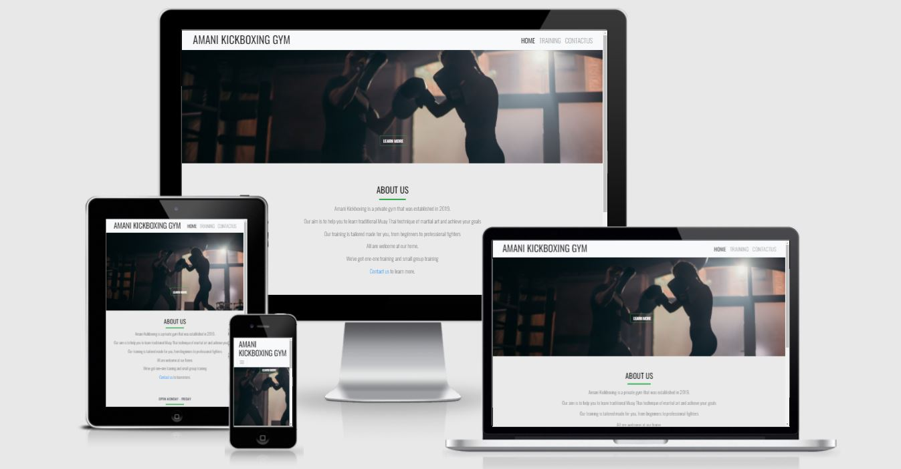
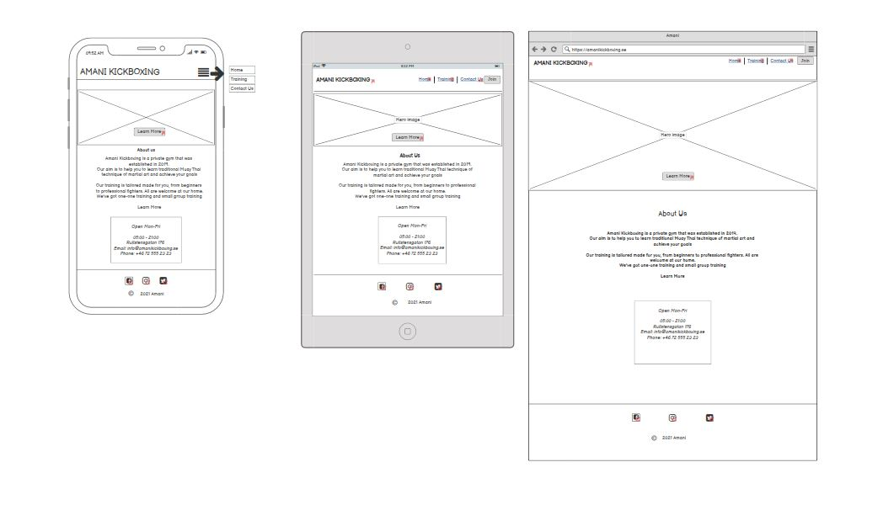
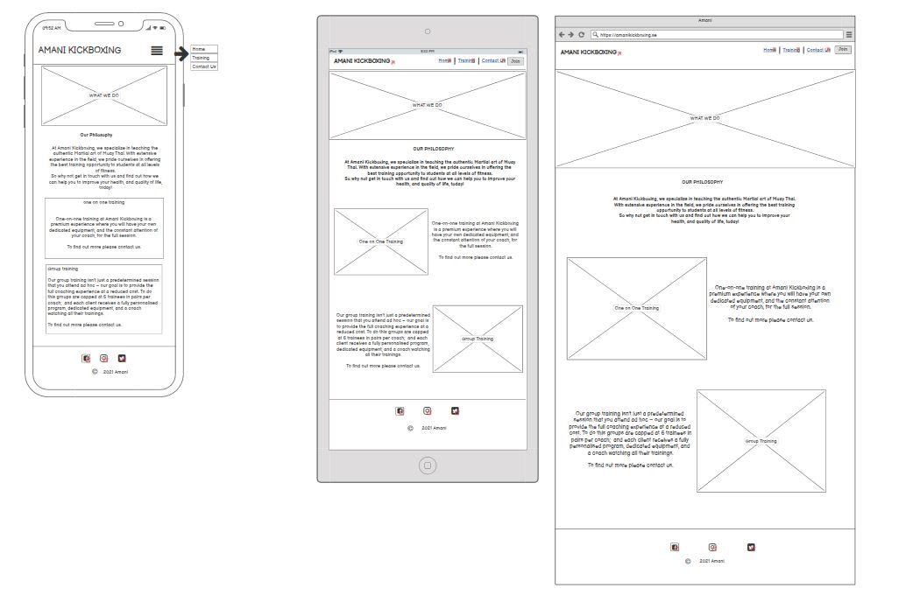
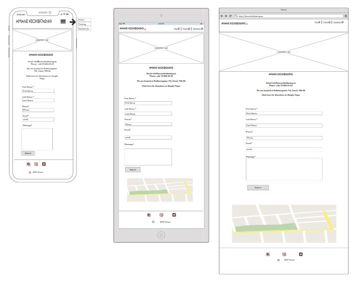

# Amani Kickboxing Gym
Click [here](https://joan-amudu.github.io/Amani-Kickboxing-Gym/) to visit the live site.



# Table of Content
# General Information
The [Code Institute](https://codeinstitute.net/) Milestone Project 1 requires students to build a static frnt-end website to prsent useful information to users.

This project will demonstate HTML5 and CSS3 skills, as well Bootstrap which was used in the creation of a form.

The project idea is to build a website for a gym. In this case, the website is for a kickboxing gym where information presented on the site will enable users to learn more about the gym and the services/ trainings they offer.

This project was created using the mobile first stategy where a website is created and developed for mobile users first, then tablets and finally desktop users.
# UX
This section highlights the business objectives and user experience .

## Business Objectives 
* Capture a wider market and attract new clients.
* Establish an online presence through the new website and social media interactions.


## User Stories
* As a site owner, I want the landing page to have relevant information, so that visitors can immediately understand what the business is about.
* As a site owner, I want contact details to be available on the landing page, so that visitors can have quick access to contact information.
* As a visitor, I want to easily navigate the site, so that I can quickly find information.
* As a visitor, I want information about training times, so I can know which training days and times work best for me.
* As a visitor, I want to know what services or training is available, so that I can make an informed decision to join the gym.
## Design 
The webiste's design and layout is based on fonts, colors, wireframes, images and icons.

### Fonts
* [Google Fonts](https://fonts.google.com/) was imported to CSS with the Oswald font family being the main font and San Serif the fall back font.

### Wireframes
* Wireframes were created using the [Balsamiq](https://balsamiq.com/wireframes/) software.

Home Page 
 

 Training Page


Contact Us Page


* A pdf of the wireframes can be found [here](/assets/Wireframes/Amani_Wireframes_MS1.pdf). This file can also be downloaded from Github. (**Please Note:** _[Adobe Acrobat Reader](https://get.adobe.com/reader/) is required to view files in pdf format_).


# Features
The website incorparates a header with the logo on the left a navigation bar with menu items on the left. It aslo incorporates a footer with social media icons and copyright information. The header and footer maintain consistency on all pages.


## Home
The **Home** page allows the user to have ease of access and navigation to all other pages, from the navigation bar, **call-to-action** buttons, and links to other pages and social media platforms in the footer of the page.

The **Home** page fetaure a hero image with a **learn more** button at the bottom center of the hero image. The button, when clicked, takes the user to the **Training** page.

The **About Us** content is created in a **section** with information presented in the center and includes a link to the **Contact Us** page. 

Information about the gym's **opening hours** is also created in a **section** with the content presented in the center. 


## Training 
The **Training** page feature a hero image.The Train page aslo and incorporates the gym's phylosophy.

Two **sections** provide relevant information presented in **two columns** each - with the type of train information and appropriate **image**.

## Contact Us 
The contact us page includes detailed contact information

- [Email address](mailto:info@amanikickboxing.com) - a business email that the user can to contact us
- Phone number - a business contact number that is available during business hours
- Address with directions on [google maps](https://www.google.com/maps/place/Rullstensgatan+176,+906+55+Ume%C3%A5/)
- Contact form - the user can use the form to send inquiries about any of our trainings.
    
 
# Technologies
This project is created with:
* HTML5 - used for building the website
* CSS3 - for styling elements
* Google Fonts - Oswald used for the font-family and Sans-Serif as the fall-back.
* Bootstrap CDN
    - Font Awesome - for Icons
    - Bootstrap
* JavaScript
* Font Awesome - for Icons.
* Balsamic - to creation of the Wireframes.
* GitHub - Used for hosting the code and version control.
* GitHub Pages - This is where the site is deployed.

# Testing 

## Testing User stories
1. As a site owner, I want the landing page to have relevant information, so that visitors can immediately understand what the business is about.
    - From the logo alone, a user can immediately know what the website is about.
    - Hero images demonstate what clients can expect from the webiste and from the gym in general.
    - The **Training** page gives detailed imformation on the services/traininging that are being offered.   

2. As a site owner, I want contact details to be available on the landing page, so that visitors can have quick access to contact information.
    - The **Home** page have contact details listed. The **Email** address opens up an external link to microsoft mail which lists the most used emails. 
    - From the navigation bar, the visitor can access contact details by clicking the **Contact Us** menu.
3. As a visitor, I want to easily navigate the site, so that I can quickly find information.
    - The site has a navigation bar in the header with menu items (Home, Training and Contact Us) that link to their respective pages.
    - The site also features a footer with socila media icons that open externally to their respective webistes.
4. As a visitor, I want information about training times, so I can know which training days and times work best for me.
    - Information on opening hours on the **Home** page is clearly displayed.
5. As a visitor, I want to know what services or training is available, so that I can make an informed decision to join the gym.
    - On the **Training** page, detailed information about the trainings offered is clearly displayed with accompanying images. 
## Functional Testing
### All pages
The testing below is identical on all pages (Home, Training, and Contact Us)
Action | Expected Result | Pass/Fail 
---------------|---------------|---------------
Clicking Logo | Clicking on the logo will return the user to the home page | Pass
Resizing Navigation bar | Menu Items collapse to humburger icon when the screen size is reduced to mobile view | Pass
Clicking humburger Icon|  In mobile, view will display the menu items | Fail
Active page| The active page has the same black color as the logo and a heavier font-weight while inactive menu items remain a lighter grey color | Pass
Hovering over Links | This link is blue when inactive to draw emphasis on it and when hovered over, turn grey with a margin below it | Pass
Clicking Links | When clicked, navigates the user to it's respective page | Pass
Clicking Social Media Icons | Opens in new page when clicked for their respective sites | Pass
||


### Home Page
Action | Expected Result | Pass/Fail 
---------------|---------------|---------------
Hovering Learn More Button | Turns green when hovered over | Pass
Clicking Learn More Buttom | When clicked, directs the user to the **Training** page | Pass
Emai address link | Opens external email | Pass
||


### Contact Us Page
Action | Expected Result | Pass/Fail 
---------------|---------------|---------------
Clicking **Click Here** Link | Opens an external page with directions on google maps | Pass
Contact form: Clicking the submit button without any input in the field | User will get prompted to fill in all fields | Pass
Inputing wrong email format | User will get propmted to enter correct email format | Pass
Clicking Send Button | User will recieve successful Modal message | Fail
||

## Validators
- [HTML Validator](https://validator.w3.org/) .
- [CSS Validator](https://jigsaw.w3.org/css-validator/) - The  CSS Validation Service was used to valid CSS. No Error found.

## Brower Compatitbility
This site has been tested successfully on the following browsers:
  - Google Chrome
  - Microsoft Edge
  - Firefox
  - Safari
  - Internet Explorer
  

# Deployment
This website was created in gitpod, which is linked to Github. All changes were commited and pushed to Github.

## GitHub Pages

The project was deployed to GitHub Pages using the following steps...

1. Log in to GitHub and locate the [GitHub Repository](https://github.com/Joan-Amudu/Amani-Kickboxing-Gym/)
2. At the top of the Repository (not top of page), locate the "Settings" Button on the menu.
3. Scroll down the Settings page until you locate the "GitHub Pages" Section.
4. Under "Source", click the dropdown called "None" and select "Master Branch".
5. Click save.
6. The page will automatically publish to GitHub pages 
7. Scroll back down through the page to locate the now published site [link](https://joan-amudu.github.io/Amani-Kickboxing-Gym/) in the "GitHub Pages" section.


### Making a Local Clone

1. Log in to GitHub and locate the [GitHub Repository](https://github.com/)
2. Under the repository name, click Code.
3. To clone the repository, select HTTPS and copy the link.
4. Open Git Bash.
5. Change the current working directory to the location where you want the cloned directory to be made.
6. Type `git clone`, and then paste the URL you copied in Step 3.

```
 git clone https://github.com/YOUR-USERNAME/YOUR-REPOSITORY
```
    * To clone this particular repository:
    git clone https://github.com/Joan-Amudu/Amani-Kickboxing-Gym.git

7. Press Enter. Your local clone will be created.
8. Change into the directory being created.
9. Clicking index.html, opens the site in a browser.

Click [Here](https://help.github.com/en/github/creating-cloning-and-archiving-repositories/cloning-a-repository) for more information about cloning repositories.


# Credits
Below are the resources that were used to create this website.

* [Bootstrap](https://getbootstrap.com/docs/4.3/getting-started/introduction/), a popular front-end open source toolkit has been used for the columns, rows, buttons and form.
* [Font Awesome](https://fontawesome.com/) was used for the social media icons. Here, the free icons were selected and styled to match the overall color-scheme of the website. 

* [Pexels](https://www.pexels.com/) - Used for free stock
    - [cottonbro](https://www.pexels.com/@cottonbro)
    


## Other resources
* [w3schools.com](https://www.w3schools.com/default.asp): used for a deeper understanding of HTML and CSS.
* [StackOverflow](https://stackoverflow.com/): Used for troubleshooting. 
* Code Institute course modules.

# Acknowledgements
I would like to acknowledgement my mentor Dick who guided me throughout the project.


